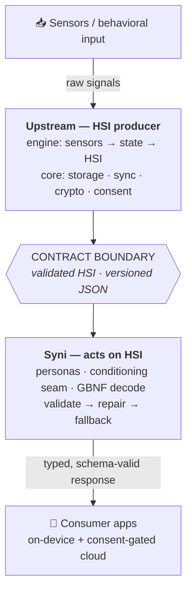

<div align="center">

# Syni

**Persona-driven, on-device adaptive agent.**

Syni runs on the [Human State Interface (HSI)](https://github.com/synheart-ai/hsi) —
a typed, versioned human-state contract — and turns it into personalized,
**schema-safe** responses, on-device and (with consent) in the cloud.

[](#citation)
[](LICENSE)
[](https://docs.synheart.ai/syni/overview)
[](https://github.com/synheart-ai/hsi)

[Paper](#citation) · [Docs](https://docs.synheart.ai/syni/overview) · [HSI Contract](https://github.com/synheart-ai/hsi) · [Personas](#personas)

</div>

---

> 📄 **Accepted at MobileHCI 2026.**
> *Syni: Acting on Human State Without Sensing It — An On-Device, Privacy-Oriented
> Agent over a Human State Interface.*
> Israel Goytom Birhane, Henok Biadglign Ademtew, Yisak Tola Debele, Anwar Misbah.
>
> 🔗 **Read the paper:** _coming soon_ <!-- TODO: paste ACM DL / arXiv URL here when available -->

This repository is the **concepts, guides, and glossary** — the mental models for
building with Syni. It is documentation, not code; the SDKs and runtime live in
their own repositories ([below](#repositories)).

## Why Syni

- 🧩 **A contract, not raw data** — Syni takes a validated, consent-gated HSI
  payload as typed input. Raw biosignals never reach the model.
- ✅ **Schema-safe by construction** — grammar-constrained decoding (GBNF) plus a
  `validate → repair → fallback` net. The UI *always* gets a typed, valid response
  — even when the model is too slow or wrong.
- 🎭 **Versioned personas** — a persona id resolves to the *same* behavior on
  device and in the cloud, pinned to a spec version.
- 📱 **On-device first** — runs locally under a latency/token budget; hybrid
  local/cloud with consent when you want it.
- 🧷 **A versioned conditioning seam** — how HSI is rendered into the prompt is a
  *contract*, shared byte-identically by training and inference, so behavior can't
  silently drift.
- 🔒 **Reduced model-exposure surface** — the model sees only a derived,
  consent-gated projection; raw signals and consent enforcement stay upstream.

## Where Syni sits

Syni **acts on** HSI — persona-driven, schema-safe generation. Producing HSI
(sensing, signal processing, state inference) and enforcing consent, storage, and
crypto happen **upstream**, where the raw data stays.

> **Infer upstream, act downstream.** That single split is the contract boundary
> that shapes every decision here.



## Quick taste

Add an SDK, install the runtime via the `synheart` CLI, and talk to a persona:

```dart
import 'package:syni/agent.dart';

final agent = SyniAgent();
final persona = await SyniSpecPersona.load('focus.coach.v1');
await agent.install(persona: persona, model: SyniModels.qwen25_15bInstructQ4);

final reply = await agent.chat('How can I focus right now?');
print(reply.displayText);
```

```bash
synheart install runtime syni   # drops verified platform binaries into your app
```

Full, runnable examples live in each SDK repo — [Flutter](https://github.com/synheart-ai/syni-flutter),
[Swift](https://github.com/synheart-ai/syni-swift), [Kotlin](https://github.com/synheart-ai/syni-kotlin).

## Personas

A **persona** is a versioned JSON contract for how Syni behaves — the *same*
persona id resolves to the *same* behavior on device and in the cloud. Personas
live in the immutable [Syni Spec](https://docs.synheart.ai/syni-spec/overview)
(installed via the `synheart` CLI) and are materialized at runtime.

Each persona declares:

| Field | Meaning |
|-------|---------|
| `id` | Stable, versioned — e.g. `focus.coach.v1` |
| `output_schema_id` | JSON Schema every response must satisfy — e.g. `coach.response.v1` |
| `safety_rule_ids` | Global constraints — e.g. `global.no_harmful_content`, `global.no_medical_diagnosis` |
| `execution_policy` | `local` · `cloud` · `hybrid` |
| `capability_tier` | Cloud lane — `fast` · `standard` · `deep` |
| `privacy`, `budget` | Exposure tier and latency/token limits |

**Production personas:** `focus.coach.v1`, `stress.coach.v1`,
`cognitive.companion.v1`, `performance.coach.v1`, `wellness.guide.v1`.

Learn more → [concepts/personas.md](concepts/personas.md) ·
[guides/creating-personas.md](guides/creating-personas.md) ·
[docs.synheart.ai/syni](https://docs.synheart.ai/syni/overview)

## Repositories

### Syni SDKs — open source

| Repo | Platform |
|------|----------|
| [syni-flutter](https://github.com/synheart-ai/syni-flutter) | Flutter — Dart FFI, hybrid local/cloud chat, streaming API |
| [syni-swift](https://github.com/synheart-ai/syni-swift) | iOS / macOS — Swift FFI |
| [syni-kotlin](https://github.com/synheart-ai/syni-kotlin) | Android — JNI |

All three expose the same `SyniAgent` API — same methods, states, and
persona/model catalog; only the platform idioms differ.

### Runtime, spec & cloud

- **syni-runtime** — the portable on-device LLM engine (llama.cpp control-plane,
  C ABI, GBNF grammar-constrained decoding, presets). Not open source; installed
  free via the `synheart` CLI. See
  [docs.synheart.ai/syni/overview](https://docs.synheart.ai/syni/overview).
- **syni-spec** — the canonical behavioral contract: personas, output schemas,
  GBNF grammars, safety rules, budgets. Not open source; installed via the
  `synheart` CLI. See [docs.synheart.ai/syni-spec](https://docs.synheart.ai/syni-spec/overview).
- **Syni Cloud** — cloud gateway, LLM router, persona/memory runtime (proprietary).

### The contract Syni runs on — open source

| Repo | Role |
|------|------|
| [hsi](https://github.com/synheart-ai/hsi) | Canonical HSI schema, RFCs, test vectors — the input contract |
| [synheart-core-flutter](https://github.com/synheart-ai/synheart-core-flutter) · [synheart-core-kotlin](https://github.com/synheart-ai/synheart-core-kotlin) · [synheart-core-swift](https://github.com/synheart-ai/synheart-core-swift) | Platform SDKs that *produce* HSI in the app process |

In a typical app, both `synheart-core-*` (produces HSI) and `syni-*` (runs on it)
are present.

## What's in this repo

- **concepts/** — the mental models:
  [hsi.md](concepts/hsi.md) · [personas.md](concepts/personas.md) ·
  [persona-engine.md](concepts/persona-engine.md) ·
  [safety-model.md](concepts/safety-model.md) ·
  [on-device-vs-cloud.md](concepts/on-device-vs-cloud.md) ·
  [cco.md](concepts/cco.md) · [ppe.md](concepts/ppe.md)
- **guides/** — how to build:
  [sdk-overview.md](guides/sdk-overview.md) ·
  [building-with-syni.md](guides/building-with-syni.md) ·
  [creating-personas.md](guides/creating-personas.md)
- [glossary.md](glossary.md) · [CONTRIBUTING.md](CONTRIBUTING.md) · [CHANGELOG.md](CHANGELOG.md)

### Start here

| I want to… | Read |
|------------|------|
| Understand HSI and where it comes from | [concepts/hsi.md](concepts/hsi.md) |
| Build with Syni | [guides/sdk-overview.md](guides/sdk-overview.md) → [guides/building-with-syni.md](guides/building-with-syni.md) |
| Author a persona | [concepts/personas.md](concepts/personas.md) + [guides/creating-personas.md](guides/creating-personas.md) |
| Choose on-device vs cloud | [concepts/on-device-vs-cloud.md](concepts/on-device-vs-cloud.md) |
| See how it's kept safe | [concepts/safety-model.md](concepts/safety-model.md) |

## Key terms

| Term | Description |
|------|-------------|
| **HSI** | Versioned JSON *contract* for human-state signals. Syni's input. |
| **Persona** | Versioned behavioral spec (role, voice, boundaries), materialized at runtime. |
| **Conditioning seam** | The versioned rendering of HSI into the prompt, shared byte-identically by training and inference. |
| **Preset** | Latency/token/grammar envelope (`keyboard`, `coach`, `chat`). |
| **Grammar (GBNF)** | Constrains decoding to schema-valid output at generation time. |
| **CCO / PPE** | Context·Constraints·Output framing; Persona·Policy·Execution separation. |

## Citation

If you reference Syni or the HSI-consumer architecture, please cite it
(BibTeX to be updated with the ACM DL entry):

```bibtex
@inproceedings{goytom2026syni,
  title     = {Syni: Acting on Human State Without Sensing It --- An On-Device,
               Privacy-Oriented Agent over a Human State Interface},
  author    = {Goytom Birhane, Israel and Ademtew, Henok Biadglign and
               Debele, Yisak Tola and Misbah, Anwar},
  booktitle = {28th International Conference on Mobile Human-Computer
               Interaction (MobileHCI '26)},
  year      = {2026},
  doi       = {10.1145/3821581.3833109},
  note      = {Late-Breaking Work}
}
```

## Contributing

Documentation-first: keep concepts, guides, and examples aligned and internally
consistent. Issues, suggestions, and doc PRs are welcome — see
[CONTRIBUTING.md](CONTRIBUTING.md).

## License

[Apache-2.0](LICENSE) © Synheart AI Inc.
